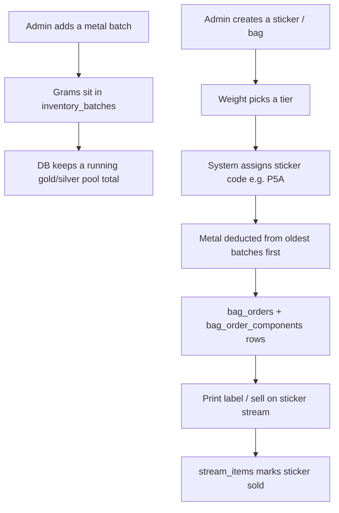

# How Sticker Inventory Works (Top to Bottom)

The sticker flow lives under **Admin → Inventory Management → Nuggets**. That page stacks two UIs:

1. **Batch Management** — you record metal you bought (gold/silver lots).
2. **Inventory Management** — you turn pooled metal into a **bag** with a unique **sticker code** you can print and sell on stream.

Think of it as: **batches = raw stock in the warehouse**, **stickers = labeled bags pulled from the pool**.

---

## The Big Picture (Layman's Terms)



---

## Where You See It in the App

| UI | File | What it does |
|----|------|----------------|
| Nuggets tab | `apps/web/src/pages/inventory/NuggetsInventoryPage.tsx` | Renders both sections below |
| Batch table | `apps/web/src/pages/InventoryMgmtPage.tsx` | List/create/edit/delete **batches** |
| Sticker table | `apps/web/src/pages/OrdersPage.tsx` | Create/list/delete **bags (stickers)** |

**Route:** `/admin/inventory-management/nuggets` (inside `InventoryLayout`, with a separate **Breaks** tab for a different inventory model).

---

## Database: How Tables Relate

### 1. `inventory_batches` — Each Purchase Lot

When you buy metal, you get a row like "Gold Batch #3" with:

| Column | Meaning |
|--------|---------|
| `grams` | How much you bought |
| `remaining_grams` | What's left after bagging |
| `metal` | `gold` or `silver` |
| `sticker_batch_letter` | One letter A–Z **per metal** (unique per metal) |
| `is_virtual_pool` | `false` for real batches; `true` for special "pool" rows |

**Real batches** are what you manage in Batch Management.

**Virtual pool batches** (migration `018`) are fake rows used only for sticker numbering and linking bag orders:

- Gold pool id `00000000000000000000000000000001`, letter **P**, name "Metal Pool (Gold)"
- Silver pool id `00000000000000000000000000000002`, letter **Q**, name "Metal Pool (Silver)"

They don't hold physical grams; they're anchors for "all gold bags" vs "all silver bags."

### 2. `metal_inventory_pool` — Running Totals Per Metal

One row per metal with `grams_on_hand` and `total_cost_on_hand`. **Database triggers** update this whenever batch `remaining_grams` changes (insert/update/delete on real batches). That gives you a **dollar-cost-average** view: how much gold/silver you have on hand and what it cost on average.

### 3. `bag_orders` — One Sticker / One Bag

Each "Create sticker" creates a row with:

- `sticker_code` — unique label (e.g. `P5A`)
- `tier_index` — from weight brackets
- `actual_weight_grams` — total bag weight
- `metal` — `gold`, `silver`, or `mixed`
- `primary_batch_id` — points at the **virtual pool** batch, not your purchase batch
- `cost_basis_usd` / `cost_basis_per_gram` — estimated cost from pool averages
- `sold_at` — set when sold on a stream

### 4. `bag_order_components` — Which Real Batches Funded the Bag

When you create a sticker, the server **splits the weight across real batches** (oldest first) and stores lines like "0.3g from Gold Batch #1, 0.2g from Gold Batch #2." It also **subtracts** those grams from each batch's `remaining_grams`.

### 5. `stream_items` — When a Sticker Is Sold Live

On a **sticker stream**, entering a sticker code creates a `stream_items` row with `sale_type = 'sticker'`. That marks the bag as sold (and blocks deleting it).

---

## Sticker Codes (How Names Are Built)

**Format:** `{pool letter}{tier number}{sequence letter}`

**Example:** `P5A` = Gold pool (**P**) + tier **5** + first bag in that tier (**A**).

Built in `apps/api/src/routes/bagOrders.ts`:

```typescript
const stickerCode =
  `${poolBatch.sticker_batch_letter}${tierIndex}${seqFromIndex(countRow?.count ?? 0)}`.toUpperCase();
```

- **Pool letter:** from virtual pool batch (`P` gold, `Q` silver) — not from the batch letter you edit in Batch Management.
- **Tier:** from total weight via `getTierIndex()` — buckets like 0–0.1g → tier 1, 0.1–0.2g → tier 2, … up through 2g+.
- **Sequence:** `A`, `B`, `C`, … based on how many bags already exist for that pool + tier (`seqFromIndex`).

The letters on **real batches** (auto-suggested A, B, C when you add a batch) are still editable in the UI, but **new stickers use P/Q**, not those per-batch letters. Those batch letters are legacy/display for the purchase lots.

---

## Part A: Batch Management (CRUD)

### Frontend Flow

1. Page loads → `GET /v1/inventory/batches` (React Query, key `["batches"]`).
2. Table grouped by purchase **date** with stats (total batches, grams, remaining, cost).
3. **Create:** modal → `POST /v1/inventory/batches` with date, metal, grams, optional spot, total cost.
4. **Update code:** blur on the 1-letter input → `PATCH /v1/inventory/batches/:id/code`.
5. **Delete:** confirm → `DELETE /v1/inventory/batches/:id`.

Admin-only for create/patch/delete; any logged-in user can **read** batches.

### Backend Flow (`apps/api/src/routes/inventory.ts`)

**Create (`POST`)**

1. Count existing batches for that metal → `batch_number`, name like "Gold Batch #4".
2. Pick next free **sticker letter** A–Z for that metal (`suggestStickerLetterFromUsedLetters`).
3. Insert row; `remaining_grams` starts equal to `grams`.
4. Triggers bump `metal_inventory_pool`.

**Patch code (`PATCH …/code`)**

- Must be A–Z, unique per metal, not on virtual pool batches.

**Delete (`DELETE`)**

- Blocked if any bag orders or stream batch links still reference it.
- Blocked for virtual pool rows.

---

## Part B: Creating Stickers (Bags)

### Frontend Flow (`apps/web/src/pages/OrdersPage.tsx`)

1. Loads three APIs in parallel:
   - `GET /v1/inventory/batches` — show which batches supplied metal in the table
   - `GET /v1/inventory/metal-pool` — "X grams on hand, $Y/gram average"
   - `GET /v1/bag-orders` — recent stickers
2. User picks metal + weight (optional second metal for mixed bags).
3. UI previews tier from `getTierIndex()` (shared logic in `apps/web/src/lib/tiers.ts`).
4. **"Create sticker"** → `POST /v1/bag-orders` with `{ primaryMetal, primaryWeightGrams, secondMetal?, secondWeightGrams? }`.
5. On success, refreshes batches, pool, and bag list.
6. **Print** opens a label window (`printLabel(stickerCode, weight)`).
7. **Remove** (if not sold) → `DELETE /v1/bag-orders/:id` — puts grams back on batches.
8. **Mark sold** on this page is **deprecated** (API returns "gone"); selling happens on **Streams**.

### Backend Flow (`apps/api/src/routes/bagOrders.ts` → `createBagOrderFromInput`)

All in one **database transaction**:

1. **Validate** body with Zod (`createBagOrderSchema` in `@gold/shared`).
2. **Total weight** → tier; error if weight doesn't fit a tier.
3. **Generate sticker code** from virtual pool + tier + count.
4. **Cost basis** from pool averages (`metal_inventory_pool`), not from a single batch.
5. **`allocateMetalFromPool`:** walk real batches (oldest `created_at` first) with `remaining_grams > 0`, take until weight is covered; error if not enough stock.
6. **Insert `bag_orders`** (primary = virtual pool id).
7. **Insert `bag_order_components`** for each allocation line.
8. **Decrement `remaining_grams`** on each real batch used.

**Read (`GET /v1/bag-orders`)**

- Returns all bags + nested components.
- `sold: true` if `sold_at` is set **or** the code appears in `stream_items` as a sticker sale.

**Delete (`DELETE /v1/bag-orders/:id`)**

- Only if not sold.
- Reverses component weights back onto batches, then deletes components and order.

---

## Part C: Selling a Sticker (Downstream)

Not on the inventory page, but completes the lifecycle:

1. Live **sticker stream** → user enters sticker code.
2. `POST /v1/streams/sticker-sale` (in `apps/api/src/routes/streams.ts`):
   - Finds `bag_orders` by code.
   - Rejects if already in `stream_items`.
   - Computes COGS from bag cost basis / components.
   - Inserts `stream_items`, sets `bag_orders.sold_at`.

After that, the bag shows **Sold** in the table and cannot be removed.

---

## Frontend ↔ Backend Wiring

- **HTTP client:** `apps/web/src/lib/api.ts` — `fetch` to `/v1/...` with JWT from login.
- **State:** TanStack React Query (`useQuery` / `useMutation`) — cache keys like `["batches"]`, `["bag-orders"]`; invalidate after mutations so tables refresh.
- **API server:** Fastify (`apps/api/src/server.ts`) registers `inventory` and `bagOrders` routes.
- **Database:** SQLite/Turso-style schema in `turso/migrations/` (Supabase migrations mirror much of this for hosted Postgres).

---

## Mental Model Summary

| Step | You do | System does |
|------|--------|-------------|
| 1 | Add batch | Stores purchase; pool totals update |
| 2 | Create sticker | Picks tier + code; pulls grams from oldest batches |
| 3 | Print | Browser label with barcode |
| 4 | Sell on stream | Links code to stream sale; locks bag |
| 5 | Remove bag (optional) | Only if unsold; restores grams to batches |

**Batch Management** = bookkeeping for **incoming metal**.

**Inventory Management (stickers)** = **outgoing labeled product** from the pooled stock, with traceability via `bag_order_components` back to which purchase lots paid for each bag.

---

## Key Source Files

| Area | Path |
|------|------|
| Nuggets page shell | `apps/web/src/pages/inventory/NuggetsInventoryPage.tsx` |
| Batch UI | `apps/web/src/pages/InventoryMgmtPage.tsx` |
| Sticker/bag UI | `apps/web/src/pages/OrdersPage.tsx` |
| Inventory API | `apps/api/src/routes/inventory.ts` |
| Bag orders API | `apps/api/src/routes/bagOrders.ts` |
| Stream sticker sales | `apps/api/src/routes/streams.ts` |
| Weight tiers | `apps/api/src/domain/tiers.ts` |
| Virtual pool IDs | `apps/api/src/domain/bagPool.ts` |
| Shared validation | `packages/shared/src/index.ts` |
| Initial schema | `turso/migrations/001_init.sql` |
| Pool + virtual batches | `turso/migrations/012_breaks_and_pool.sql`, `turso/migrations/018_bag_pool_cost_basis.sql` |
| Label printing | `apps/web/src/utils/printLabel.ts` |
